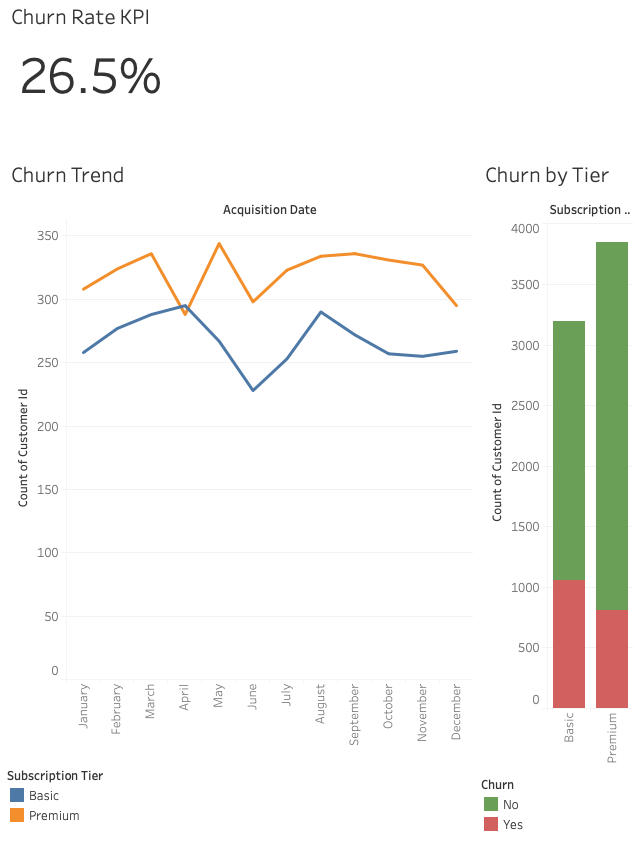
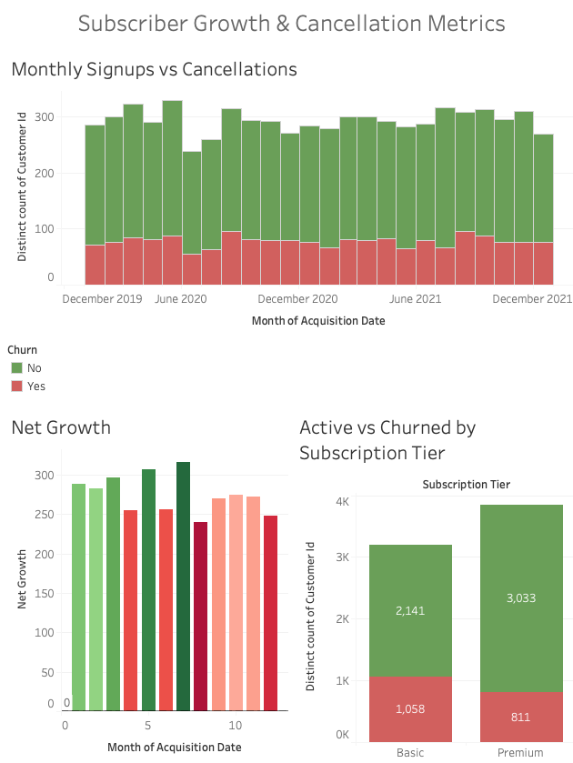
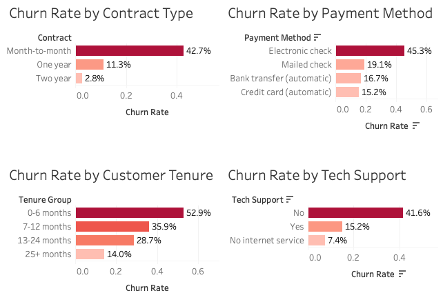
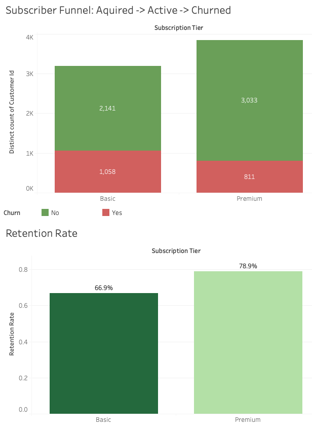

# Streaming Platform Subscriber Churn Analysis

An end-to-end analysis of subscriber churn patterns for a streaming platform, covering SQL-based analytics and an interactive Tableau dashboard. The goal was to understand why customers leave, which segments are most at risk, and where revenue is being lost.

---

## What This Project Covers

- Monthly churn rate broken down by subscription tier (Basic vs Premium)
- Revenue lost and projected annual revenue at risk from churned subscribers
- Cohort survival analysis tracking what percentage of subscribers from each signup month are still active at 3, 6, and 12 months
- Average customer lifetime value segmented by acquisition channel
- Month-over-month subscriber growth vs cancellation rate using SQL window functions
- Churn risk factors by segment — contract type, payment method, and tenure

---

## Key Findings

| Metric | Value |
|--------|-------|
| Overall churn rate | 26.5% |
| Basic tier churn rate | 33.1% |
| Premium tier churn rate | 21.1% |
| Highest risk segment | 0-6 month tenure (52.9% churn) |
| Highest churn contract | Month-to-month (42.7%) |
| Highest churn payment method | Electronic check (45.3%) |
| Churn without tech support | 41.6% |
| Churn with tech support | 15.2% |

---

## Project Structure

```
├── README.md
├── sql/
│   ├── 00_schema.sql                                # Database schema (3 tables)
│   ├── 01_churn_analysis.sql                        # Queries 1-4: core churn metrics
│   └── 02_advanced_analytics.sql                    # Queries 5-9: cohorts, MoM, predictors
├── notebooks/
│   └── 01_data_preparation.py                       # Data cleaning and transformation
├── data/
│   └── telco_churn_clean.csv                        # Cleaned dataset (7,043 records)
└── dashboards/
    └── Streaming Platform Churn Analysis.twb        # Tableau dashboard (5 pages)
```

---

## Dataset

- **Source**: [Telco Customer Churn — Kaggle](https://www.kaggle.com/blastchar/telco-customer-churn)
- **Records**: 7,043 customers
- **Features**: 21 columns including contract type, payment method, tenure, monthly charges, and churn status
- **Enrichment**: Added synthetic acquisition dates, churn dates, acquisition channels, and subscription tiers

---

## SQL Queries

Nine queries were written to cover the full analysis:

| # | Query | Techniques Used |
|---|-------|----------------|
| 1 | Monthly churn rate by tier | CTE, GROUP BY, CASE |
| 2 | Revenue at risk | CTE, aggregation |
| 3 | Cohort survival (3/6/12 months) | CTE, date functions |
| 4 | LTV by acquisition channel | aggregation, GROUP BY |
| 5 | MoM growth vs cancellations | CTE, LAG, PARTITION BY |
| 6 | Churn predictors by segment | CTE, UNION ALL |
| 7 | Churn heatmap data | CTE, date truncation |
| 8 | Subscriber funnel | CTE, CASE |
| 9 | Retention curve by tier | CTE, GENERATE_SERIES |

---

## Dashboard Preview

### Executive Overview


### Cohort & Retention


### Growth Metrics


### Churn Predictors


### Subscriber Funnel & Retention


---

## Dashboard (Tableau)

Five dashboard pages built in Tableau Public:

1. **Executive Overview** — KPI cards, monthly churn trend, revenue impact by tier
2. **Cohort & Retention** — Churn heatmap, retention curve, LTV by acquisition channel
3. **Growth Metrics** — Monthly signups vs cancellations, net growth, tier comparison
4. **Churn Predictors** — Churn breakdown by contract, payment method, tenure, and tech support
5. **Subscriber Funnel** — Active vs churned by tier, retention rate comparison

---

## Setup

### Requirements
- PostgreSQL 12+
- Python 3.8+ with pandas and numpy
- Tableau Public (free) or Tableau Desktop

### Steps

```bash
# 1. Create database
psql -U postgres -p 5433
CREATE DATABASE churn_analysis;
CREATE USER analyst WITH PASSWORD 'your_password';
GRANT ALL PRIVILEGES ON DATABASE churn_analysis TO analyst;
\q

# 2. Create schema
psql -U analyst -p 5433 -d churn_analysis -f sql/00_schema.sql

# 3. Prepare data (download dataset from Kaggle first)
python notebooks/01_data_preparation.py

# 4. Import data
psql -U analyst -p 5433 -d churn_analysis -c "\COPY customers FROM 'data/telco_churn_clean.csv' WITH (FORMAT csv, HEADER true)"

# 5. Run analysis queries
psql -U analyst -p 5433 -d churn_analysis -f sql/01_churn_analysis.sql
psql -U analyst -p 5433 -d churn_analysis -f sql/02_advanced_analytics.sql
```

---

## Tools & Technologies

- **SQL** — PostgreSQL, CTEs, window functions (LAG, PARTITION BY), date functions
- **Python** — pandas, numpy (data cleaning and transformation)
- **Tableau** — calculated fields, heatmaps, cohort analysis, funnel charts
- **Database** — PostgreSQL with indexed tables for query performance
